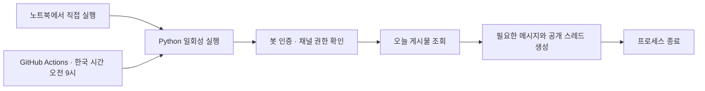

# DetoxMate Discord Bot

제품 개발팀을 위한 **오늘의 질문**과 **오늘의 할 일**을 게시하는 Python 봇입니다. Discord REST API를 호출한 뒤 종료하며, 별도 AI API·데이터베이스·상시 서버를 사용하지 않습니다.

| 기능 | 한국 시간 예약 | 게시 내용 |
| --- | --- | --- |
| 오늘의 질문 | 매일 오전 **9:00** | 질문 365개 중 무작위 순서로 하나와 대화 스레드 |
| 오늘의 할 일 | 매일 오전 **9:00** | 날짜별 스레드와 한 일·병목·오늘의 한마디·회고 작성 양식 |

두 기능 모두 주말과 공휴일을 포함해 주 7일 실행합니다. 실행 환경의 시간대와 관계없이 날짜와 요일은 `Asia/Seoul`을 사용합니다.



## 1. Discord 봇과 채널 준비

1. [Discord Developer Portal](https://discord.com/developers/applications)에서 **New Application**으로 앱을 만듭니다.
2. 앱의 **Bot** 페이지에서 봇 토큰을 발급받습니다. 이 토큰은 비밀번호처럼 취급하고 로컬 `.env`와 GitHub Actions Secret에만 넣습니다.
3. **OAuth2 → URL Generator**에서 `bot` 범위를 선택하고 아래 권한을 체크합니다. 서버 설치(Guild Install)를 선택한 후 생성된 URL로 본인의 서버에 초대합니다. 이 봇에는 슬래시 명령이나 Interactions Endpoint 설정이 필요하지 않습니다.

| 봇 권한 | 용도 |
| --- | --- |
| View Channels | 지정한 채널 접근 |
| Send Messages | 질문/할 일 안내 게시 |
| Read Message History | 기존 게시물을 찾아 중복 방지 |
| Create Public Threads | 안내 메시지에서 공개 스레드 생성 |
| Send Messages in Threads | 스레드 참여 권한 |

4. 같은 서버에 일반 **텍스트 채널** `오늘의-질문`, `오늘의-할일`을 만듭니다. 포럼·음성 채널이나 기존 스레드 ID는 사용하지 않습니다.
5. 두 채널의 권한 설정에서도 봇에 위 권한이 허용되어 있는지 확인합니다. 관리자 권한은 필요 없습니다. 팀원에게는 채널 보기와 **Send Messages in Threads**를 허용합니다.
6. Discord 사용자 설정 → 고급 → **개발자 모드**를 켭니다. 각 채널을 우클릭하고 **채널 ID 복사**를 선택합니다. 서버 ID나 채널 이름이 아닌 숫자 채널 ID가 필요합니다.

이 구현은 이벤트를 수신하지 않고 자신이 작성한 메시지만 식별하므로 Privileged Gateway Intents를 켤 필요가 없습니다. 봇이 Discord에서 오프라인으로 표시되어도 REST API 게시에는 문제가 없습니다. [Discord의 메시지 콘텐츠 예외](https://docs.discord.com/developers/events/gateway#message-content-intent)

## 2. 노트북에서 확인

Python 3.9 이상에서 실행할 수 있으며 새 환경에는 Python 3.12 이상을 권장합니다. GitHub Actions는 Python 3.12를 사용합니다. Python 표준 라이브러리만 사용하므로 `pip install`은 필요하지 않습니다. macOS/Linux의 시간대 데이터가 필요합니다.

프로젝트 폴더에서 먼저 미리보기를 실행합니다. 이 명령은 토큰 없이 동작하고 Discord 요청을 보내지 않습니다.

```bash
python3 detoxmate-discordbot.py --dry-run
python3 detoxmate-discordbot.py --dry-run --date 2026-09-10
```

`.env.example`을 `.env`로 복사합니다. 이미 `.env`가 있다면 기존 파일을 편집합니다.

```bash
cp -n .env.example .env
```

편집기로 `.env`의 아래 세 항목을 채웁니다. 값 뒤에 주석을 붙이지 마세요. `.env`는 Git에서 제외되어 있으며, 셸에서 이미 설정한 환경 변수가 `.env`보다 우선합니다.

```dotenv
DISCORD_BOT_TOKEN=발급받은_봇_토큰
QUESTION_CHANNEL_ID=질문_채널의_숫자_ID
TODO_CHANNEL_ID=할일_채널의_숫자_ID
```

연결과 권한을 확인한 뒤 실제 게시를 실행합니다.

```bash
# 읽기 전용: 인증, 채널 종류, 봇의 실제 채널 권한 확인
python3 detoxmate-discordbot.py --check

# 지금 즉시 게시하고 종료: 질문과 할 일 모두 주 7일
python3 detoxmate-discordbot.py

# 같은 날 한 번 더 실행해서 중복되지 않는지 확인
python3 detoxmate-discordbot.py
```

각 채널에 메시지 하나와 연결된 스레드 하나가 생기는지 확인합니다. 할 일 스레드 제목은 `09월 10일 · 오늘의 할 일` 형식이며 시작 메시지에 아래 양식이 표시됩니다. 팀원은 스레드 안에 답변하면 됩니다.

```text
[오늘 할 일]

한 일 :
병목 (없으면 없음) :
오늘의 한마디 :
회고 :
```

한 기능만 실행하려면 `--job question` 또는 `--job todo`를 붙입니다. `--date`는 미리보기 전용입니다. 실제 실행은 언제나 실행 시작 시점의 한국 날짜로 게시하며 오전 9시를 기다리지 않습니다. 날짜는 게시물과 스레드 제목에 자동으로 표시됩니다.

## 3. GitHub에 업로드

로컬 실제 게시와 스레드 확인을 마친 뒤 GitHub에 빈 저장소를 만들고 프로젝트를 올립니다. 아래 `YOUR_ACCOUNT`와 저장소 주소를 본인의 것으로 바꿉니다. 이미 Git 저장소라면 초기화는 생략합니다.

```bash
git init -b main
git add .gitignore .env.example README.md detoxmate-discordbot.py detoxmate questions.json tests .github
git status --short
git commit -m "Add daily Discord question and todo bot"
git remote add origin https://github.com/YOUR_ACCOUNT/detoxmate-discordbot.git
git push -u origin main
```

`.env`가 커밋 대상에 없는지 확인합니다. 실수로 토큰을 커밋했다면 해당 토큰을 Discord에서 재발급하고 로컬/GitHub 값을 교체합니다.

## 4. GitHub Actions 설정

저장소 **Settings → Secrets and variables → Actions**에 다음 값을 등록합니다.

| 탭 | 이름 | 값 |
| --- | --- | --- |
| **Secrets** | `DISCORD_BOT_TOKEN` | 로컬에서 검증한 봇 토큰 (`Bot ` 접두사 제외) |
| **Variables** | `QUESTION_CHANNEL_ID` | 오늘의 질문 텍스트 채널 ID |
| **Variables** | `TODO_CHANNEL_ID` | 오늘의 할 일 텍스트 채널 ID |

채널 ID는 비밀 값이 아니므로 Repository Variables를 사용합니다. 토큰은 반드시 Repository Secret에 저장합니다. 테스트 워크플로에는 봇 토큰이 전달되지 않습니다.

1. 위 파일들이 저장소의 **기본 브랜치**에 있는지 확인합니다.
2. **Actions → 오늘의 질문 → Run workflow**를 선택합니다. `dry_run` 체크 상태에서는 로그에 미리보기만 출력됩니다.
3. 실제 게시 테스트에는 `dry_run` 체크를 해제합니다. **오늘의 할 일**도 같은 방식으로 실행합니다.
4. 이미 로컬에서 같은 날 게시했다면 기존 메시지와 스레드를 재사용합니다. 실행 로그의 Discord 링크로 결과를 확인합니다.
5. 이후 GitHub가 예약 시간마다 실행 환경을 준비하고 코드를 실행한 뒤 종료합니다. 노트북이 꺼져 있어도 동작합니다.

예약 실행은 `dry_run` 없이 실제 게시합니다. 코드 push/PR은 Python 테스트만 실행하며 Discord에 게시하지 않습니다.

### 시간 변경

각 워크플로에서 `cron`의 분·시를 수정하고 기본 브랜치에 반영합니다. `timezone: Asia/Seoul`을 유지하면 UTC로 환산할 필요가 없습니다.

```yaml
# .github/workflows/daily-question.yml — 매일 한국 시간 09:00
schedule:
  - cron: '0 9 * * *'
    timezone: Asia/Seoul

# .github/workflows/daily-todo.yml — 매일 한국 시간 09:00
schedule:
  - cron: '0 9 * * *'
    timezone: Asia/Seoul
```

### 예약 실행의 한계

오전 9시는 **예약 기준 시각**입니다. GitHub Actions는 정각 실행을 보장하지 않으며, 특히 매시 정각의 혼잡으로 지연되거나 실행이 누락될 수 있습니다. 누락된 날을 자동으로 소급 게시하지 않습니다. 필요하면 당일 `Run workflow`로 다시 실행합니다. 자정을 넘겨 시작한 실행은 실제 실행일의 한국 날짜를 사용합니다.

예약은 기본 브랜치에서만 동작합니다. 공개 저장소는 60일 동안 저장소 활동이 없으면 예약 워크플로가 자동 비활성화될 수 있으므로 Actions 상태를 확인하고 필요하면 다시 활성화합니다. [GitHub 공식 예약 문서](https://docs.github.com/en/actions/reference/workflows-and-actions/events-that-trigger-workflows#schedule)

## 게시 복구와 질문 관리

- `questions.json`에는 밸런스 게임, 엉뚱한 상상, 음식·취미·여행, 개발팀 잡담 등 질문 365개가 있습니다. 매일 새 문장을 생성하는 방식이 아니라 준비한 질문을 무작위 순서로 선택하며, 별도 AI 호출이나 API 비용은 없습니다.
- 2026-09-10을 기준으로 365일씩 순환합니다. 한 순환 안에서는 질문이 중복되지 않고 다음 순환에서는 순서를 다시 섞습니다. 순환 경계에서도 같은 질문이 이틀 연속 나오지 않습니다. 운영 중 목록을 바꾸거나 실행이 누락되면 실제로 보게 되는 질문 이력은 달라질 수 있습니다.
- 날짜와 질문 목록이 같으면 로컬과 GitHub에서도 같은 질문이 선택됩니다. 이를 위해 해시로 재현 가능한 무작위 순서를 정하므로 매번 실행할 때 질문이 바뀌지는 않습니다. 이미 게시된 당일 글은 기존 내용을 유지하며, 템플릿 변경도 다음에 생성되는 게시물부터 적용됩니다.
- 매번 Discord 채널의 오늘 기록을 조회해서 **동일한 봇이 작성한 날짜·기능 식별자**를 찾습니다. GitHub 캐시나 로컬 파일을 상태 저장소로 사용하지 않습니다.
- 부모 메시지만 올라간 상태로 실패하면 같은 날 재실행할 때 누락된 스레드만 생성합니다. 이미 보관된 스레드도 재사용합니다.
- 메시지 전송 재시도에는 Discord의 `nonce`와 `enforce_nonce`를 사용합니다. 스레드는 부모 메시지 ID당 하나만 생성할 수 있다는 Discord 규칙을 사용합니다. HTTP 429는 서버가 알려 준 대기 시간을 따르고, 일시적인 네트워크/5xx 오류는 제한된 횟수로 재시도합니다. [메시지 API](https://docs.discord.com/developers/resources/message#create-message), [스레드 API](https://docs.discord.com/developers/resources/channel#start-thread-from-message), [요청 제한](https://docs.discord.com/developers/topics/rate-limits)
- 기능별 Actions 동시 실행을 직렬화합니다. Discord nonce는 수 분 동안만 유효하므로 로컬과 여러 저장소에서 같은 기능을 장시간 동시 실행하는 상황까지 완전한 단 한 번 게시를 보장하지는 않습니다.
- 중복 확인에는 메시지 하단의 `detoxmate:...` 식별자가 필요합니다. 부모 메시지를 삭제하면 다음 실행에서 다시 생성될 수 있습니다. 봇 계정을 교체하면 새 봇은 이전 봇의 게시물을 재사용하지 않습니다.
- 오늘 기록은 100개씩 최대 10,000개까지 확인하며, 한도에 도달하면 중복 여부를 추측하지 않고 실패합니다. 스레드는 마지막 활동으로부터 24시간 뒤 자동 보관되며 삭제되는 것은 아닙니다.

## 문제 해결과 테스트

| 증상 | 확인할 사항 |
| --- | --- |
| `DISCORD_BOT_TOKEN` 설정 오류 | `.env` 또는 Actions Secret 이름, 토큰 앞뒤 공백과 `Bot ` 접두사 |
| HTTP 401 | 만료/재발급된 토큰인지 확인 |
| HTTP 403 또는 권한 부족 | 서버 역할뿐 아니라 채널의 역할·멤버별 권한 덮어쓰기도 확인 |
| HTTP 404 | 채널 ID, 봇의 서버 참여와 채널 접근 권한 확인 |
| 할 일이 생성되지 않음 | 실행한 `--job`, Variables, 당일 기존 게시물 여부 확인 |
| Actions 예약이 시작되지 않음 | 기본 브랜치, Actions 활성화, 비활성화된 예약, 실행 지연 확인 |
| macOS SSL 인증서 오류 | Python 설치의 인증서 설정 확인 (`Install Certificates.command`가 제공된 설치라면 실행) |
| `ZoneInfoNotFoundError` | OS의 IANA 시간대 데이터 설치 상태 확인. 필요하면 해당 Python에 `tzdata` 패키지 설치 |

```bash
python3 -m unittest discover -s tests -v
```

테스트는 실제 Discord에 연결하지 않습니다. 한국 날짜 경계와 주말 처리, 질문 순환, 인증 설정, 채널 권한 덮어쓰기, HTTP 재시도, 기록 페이지 조회, 새 프로세스의 재실행과 부분 실패 복구를 모의 HTTP 응답으로 검증합니다. 실제 서버 권한과 화면에서의 게시/스레드 생성은 위의 로컬 실행 절차로 확인합니다.
